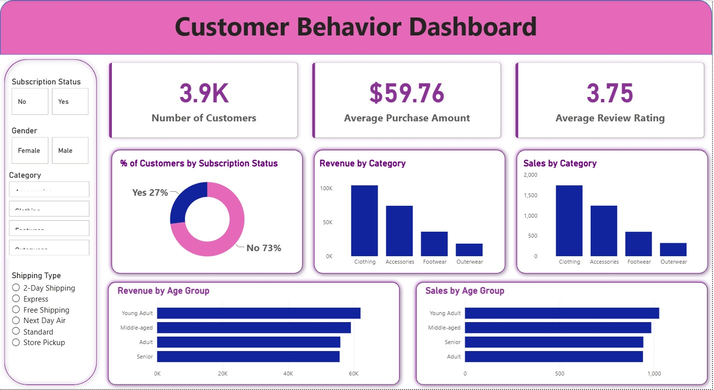

# Customer Shopping Behavior Analysis

An end-to-end data analytics project analyzing customer shopping behavior to uncover purchasing patterns, customer segments, product performance, and opportunities to improve engagement, marketing, and revenue.



## 📌 Project Overview

This project analyzes customer shopping data from a retail business to answer a central business question:

**How can the company leverage customer shopping data to identify trends, improve customer engagement, and optimize marketing and product strategies?**

The analysis follows an end-to-end analytics workflow, starting with data preparation and exploratory analysis in Python, followed by business-focused SQL analysis and an interactive Power BI dashboard.

The dataset contains **3,900 customer records and 18 attributes** covering demographics, purchases, product characteristics, customer ratings, subscriptions, discounts, shipping, payment methods, and purchasing frequency.

## 🎯 Business Objectives

The analysis focuses on understanding:

* Customer purchasing behavior across demographic groups
* Revenue contribution by gender and age group
* Product performance and customer ratings
* The relationship between discounts and purchasing behavior
* Customer subscription and repeat-purchase behavior
* Differences in spending across shipping methods
* Customer loyalty and segmentation
* Opportunities to improve marketing and retention strategies

## 🛠️ Tools & Technologies

| Tool                 | Purpose                                               |
| -------------------- | ----------------------------------------------------- |
| **Python**           | Data cleaning, preprocessing and exploratory analysis |
| **Pandas**           | Data manipulation and transformation                  |
| **SQL / PostgreSQL** | Business analysis and customer segmentation           |
| **Power BI**         | Interactive dashboard and KPI visualization           |
| **Jupyter Notebook** | Analysis workflow and documentation                   |
| **GitHub**           | Project versioning and portfolio presentation         |

## 🔄 Project Workflow

```text
Business Problem
       ↓
Data Understanding
       ↓
Data Cleaning & Preparation
       ↓
Exploratory Data Analysis
       ↓
SQL Business Analysis
       ↓
Power BI Dashboard
       ↓
Business Insights
       ↓
Recommendations
```

## 🐍 1. Python: Data Cleaning & Exploration

The dataset was first inspected to understand its structure, data types, summary statistics, and missing values.

The dataset contains **3,900 records**, with missing values identified in the `Review Rating` column.

Instead of replacing missing ratings with one overall median, the missing values were handled using the **median review rating within each product category**, preserving differences between categories.

The analysis also included:

* Data type inspection
* Missing-value analysis
* Statistical summaries
* Column-name standardization
* Data transformation
* Feature engineering
* Exploratory analysis of customer and purchasing patterns

📓 **Notebook:** [`Customer_Shopping_Behavior_Analysis.ipynb`](notebooks/Customer_Shopping_Behavior_Analysis.ipynb)

## 🗄️ 2. SQL: Business Analysis

After data preparation, SQL was used to answer business-oriented questions from a PostgreSQL database.

Some of the key questions analyzed were:

1. What is the revenue generated by male vs. female customers?
2. Which customers used a discount but still spent above the average purchase amount?
3. Which products have the highest average review ratings?
4. How does average spending differ between Standard and Express shipping?
5. Do subscribed customers spend more than non-subscribers?
6. Which products have the highest discount rates?
7. How can customers be segmented into new, returning, and loyal groups?
8. What are the top-performing products within each category?
9. Are repeat buyers more likely to subscribe?
10. Which age group contributes the most revenue?

The SQL analysis uses techniques including:

* Aggregations
* `GROUP BY`
* Filtering
* Subqueries
* `CASE WHEN`
* Common Table Expressions (CTEs)
* Window functions
* Customer segmentation
* Ranking

📄 **SQL queries:** [`customer_behavior_sql_queries.sql`](sql/customer_behavior_sql_queries.sql)

## 📊 3. Power BI Dashboard

The cleaned data was then used to build an interactive Power BI dashboard for management-level analysis.

The dashboard focuses on KPIs and visual analysis around:

* Customer volume
* Average purchase amount
* Average review rating
* Revenue
* Customer demographics
* Product categories
* Subscription behavior
* Purchasing patterns

The dashboard was designed to allow users to explore customer behavior through interactive visuals and filters.

📊 **Power BI file:** [`customer_behavior_dashboard.pbix`](dashboard/customer_behavior_dashboard.pbix)

## 🔎 Key Insights

### Customer & Revenue Behavior

The analysis shows meaningful differences in revenue contribution across customer demographics, with **young adults identified as the highest-revenue age group**, followed by middle-aged adults and senior customers.

### Subscription Behavior

Subscription status was analyzed by comparing customer count, average spend, and total revenue. The analysis found that non-subscribers represented a substantially larger customer group, while average spending between the two groups was relatively similar.

This suggests that the subscription program has an opportunity to improve its value proposition and conversion strategy rather than relying only on increasing customer spending.

### Shipping

Customers using **Express shipping showed a higher average purchase amount than Standard shipping**, indicating a potential relationship between faster delivery options and higher-value purchases.

### Product Ratings

Products including **gloves, sandals, boots, hats, and skirts** appeared among the highest-rated products in the analysis.

### Repeat Customers

The analysis identified a significant number of repeat buyers who were not subscribed. In the analyzed customer group with more than five previous purchases, **2,500 repeat buyers were non-subscribers compared with 958 subscribers**.

This represents a potential opportunity for targeted subscription campaigns aimed specifically at high-frequency customers.

## 💡 Business Recommendations

Based on the analysis, the company could:

* Target **young adult customers** with personalized campaigns because they contribute the highest revenue among the analyzed age groups.
* Focus subscription campaigns on **high-frequency repeat customers** who are currently not subscribed.
* Evaluate the value proposition of the subscription program to improve conversion among existing customers.
* Promote highly rated products more prominently in marketing campaigns.
* Investigate opportunities to expand or optimize **faster shipping options** for higher-value customers.
* Monitor products with high discount rates to identify where discounts are genuinely driving demand versus where they may be unnecessarily reducing margins.
* Use customer segmentation to create differentiated retention and marketing strategies.

## 📁 Repository Structure

```text
customer-shopping-behavior-analysis/
│
├── data/
│   └── customer_shopping_behavior.csv
│
├── notebooks/
│   └── Customer_Shopping_Behavior_Analysis.ipynb
│
├── sql/
│   └── customer_behavior_sql_queries.sql
│
├── dashboard/
│   └── customer_behavior_dashboard.pbix
│
├── reports/
│   ├── Business Problem Document.pdf
│   └── Customer Shopping Behavior Analysis.pdf
│
├── presentation/
│   └── Customer-Shopping-Behavior-Analysis.pptx
│
├── images/
│   └── dashboard.png
│
└── README.md
```

## 📚 Project Deliverables

* 🐍 Python data analysis notebook
* 🗄️ SQL business analysis queries
* 📊 Interactive Power BI dashboard
* 📄 Business problem & analysis report
* 🎤 Presentation deck
* 📁 Original dataset

## ⚠️ Data Limitation

The dataset represents a snapshot of customer behavior rather than a complete transaction history for each customer. Variables such as previous purchases capture the number of prior purchases but do not provide the complete historical transactions or historical revenue for each customer.

Therefore, findings should be interpreted as **behavioral patterns within the available dataset**, rather than a complete longitudinal customer analysis.

## 🚀 What This Project Demonstrates

This project demonstrates practical experience with the core data analyst workflow:

**Business understanding → Data cleaning → EDA → SQL → Dashboarding → Insights → Recommendations**

It combines technical analysis with business interpretation rather than focusing only on creating charts or writing queries.

## 👩‍💻 Author

**Neeta Singh**

Aspiring Data Analyst | Python | SQL | Power BI | Data Visualization

[GitHub](https://github.com/sneeta26)
